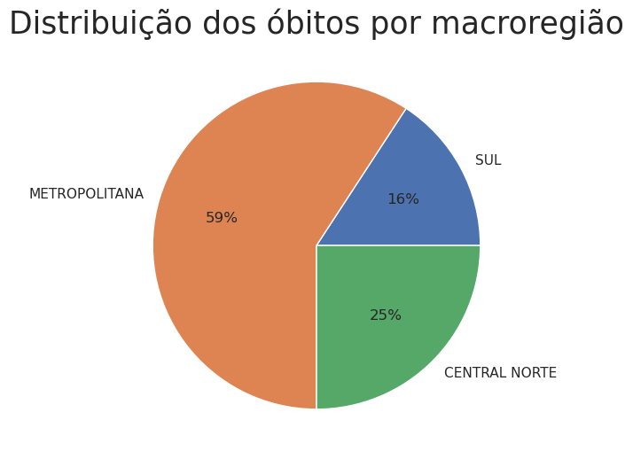
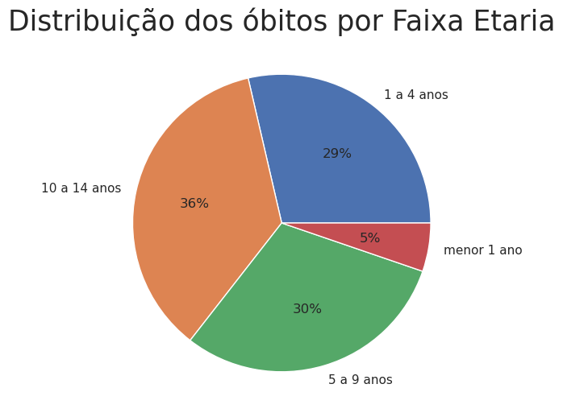
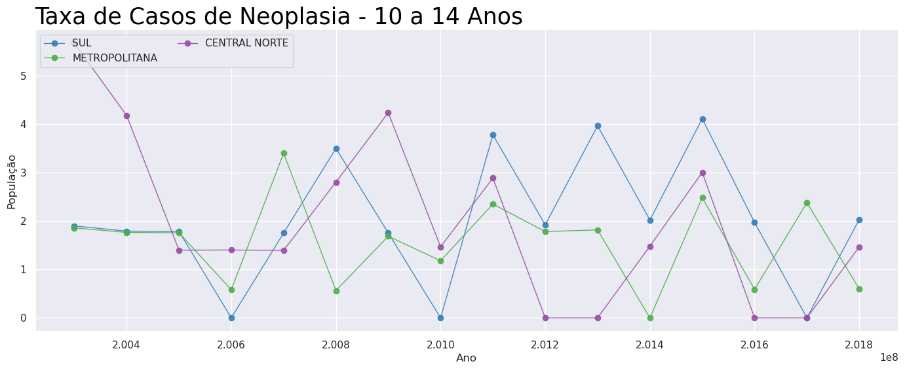

# Descritiva dos dados de Neoplastia divididos em macroregiões

Aluno: João Paulo de Paiva Holz    
Professor: Ivan Robert Enriquez Guzman  
Materia: Laboratorio de estatistica   
Categoria de cid: Cid 91-95

### Importando as bibliotecas que iremos utilizar


```python
import pandas as pd, numpy as np
import matplotlib.pyplot as plt, seaborn as sns

sns.set()
plt.rcParams['figure.figsize'] = [17, 6]
```

    /home/joaoholz/miniconda3/envs/lestat/lib/python3.8/site-packages/scipy/__init__.py:146: UserWarning: A NumPy version >=1.16.5 and <1.23.0 is required for this version of SciPy (detected version 1.23.3
      warnings.warn(f"A NumPy version >={np_minversion} and <{np_maxversion}"


## Juntando os dados


```python
dfmenor1 = pd.read_csv('data/menor1ano.csv',';')
df1a4 = pd.read_csv('data/1a4anos.csv',';')
df5a9 = pd.read_csv('data/5a9.csv',';')
df10a15 = pd.read_csv('data/10a15.csv',';')

dfmenor1 = dfmenor1.replace('-',0)
dfmenor1['faixa'] = 'menor 1 ano'

df1a4['faixa'] = '1 a 4 anos'
df1a4 = df1a4.replace('-',0)

df5a9['faixa'] = '5 a 9 anos'
df5a9 = df5a9.replace('-',0)

df10a15['faixa'] = '10 a 14 anos'
df10a15 = df10a15.replace('-',0)


pop = pd.read_csv('data/popu.csv',';')
colnames = pop.iloc[:,0]
pop = pop.transpose().iloc[5:]
pop.columns = colnames
pop = pop.apply(pd.to_numeric)
pop = pop.reset_index()

df = pd.concat([dfmenor1,df1a4,df5a9,df10a15])
df = df.drop(df[df['Ano do Óbito']=='Total'].index) 
df = df.replace('-',0)

df['Ano do Óbito'] = pd.to_numeric(df['Ano do Óbito'])
df['SUL'] = pd.to_numeric(df['SUL'])
df['METROPOLITANA']=pd.to_numeric(df['METROPOLITANA'])
df['CENTRAL NORTE']=pd.to_numeric(df['CENTRAL NORTE'])
df['Total']=pd.to_numeric(df['Total'])
```

    /tmp/ipykernel_27801/4000311993.py:1: FutureWarning: In a future version of pandas all arguments of read_csv except for the argument 'filepath_or_buffer' will be keyword-only.
      dfmenor1 = pd.read_csv('data/menor1ano.csv',';')
    /tmp/ipykernel_27801/4000311993.py:2: FutureWarning: In a future version of pandas all arguments of read_csv except for the argument 'filepath_or_buffer' will be keyword-only.
      df1a4 = pd.read_csv('data/1a4anos.csv',';')
    /tmp/ipykernel_27801/4000311993.py:3: FutureWarning: In a future version of pandas all arguments of read_csv except for the argument 'filepath_or_buffer' will be keyword-only.
      df5a9 = pd.read_csv('data/5a9.csv',';')
    /tmp/ipykernel_27801/4000311993.py:4: FutureWarning: In a future version of pandas all arguments of read_csv except for the argument 'filepath_or_buffer' will be keyword-only.
      df10a15 = pd.read_csv('data/10a15.csv',';')
    /tmp/ipykernel_27801/4000311993.py:19: FutureWarning: In a future version of pandas all arguments of read_csv except for the argument 'filepath_or_buffer' will be keyword-only.
      pop = pd.read_csv('data/popu.csv',';')


## Group By
Fazendo um simples group by vemos abaixo a tabela cruzada de faixa etaria x macrorregião.


```python
group = df.groupby(['faixa']).sum()
group.iloc[:,1:]
```


<div>
<style scoped>
    .dataframe tbody tr th:only-of-type {
        vertical-align: middle;
    }

    .dataframe tbody tr th {
        vertical-align: top;
    }

    .dataframe thead th {
        text-align: right;
    }
</style>
<table border="1" class="dataframe">
  <thead>
    <tr style="text-align: right;">
      <th></th>
      <th>SUL</th>
      <th>METROPOLITANA</th>
      <th>CENTRAL NORTE</th>
      <th>Total</th>
    </tr>
    <tr>
      <th>faixa</th>
      <th></th>
      <th></th>
      <th></th>
      <th></th>
    </tr>
  </thead>
  <tbody>
    <tr>
      <th>1 a 4 anos</th>
      <td>13</td>
      <td>49</td>
      <td>25</td>
      <td>87</td>
    </tr>
    <tr>
      <th>10 a 14 anos</th>
      <td>19</td>
      <td>61</td>
      <td>29</td>
      <td>109</td>
    </tr>
    <tr>
      <th>5 a 9 anos</th>
      <td>12</td>
      <td>60</td>
      <td>20</td>
      <td>92</td>
    </tr>
    <tr>
      <th>menor 1 ano</th>
      <td>4</td>
      <td>10</td>
      <td>2</td>
      <td>16</td>
    </tr>
  </tbody>
</table>
</div>


---
Vemos que a região metropolitava consiste da maioria da população como já se é esperado


```python
_ = plt.pie(pop.iloc[-1,1:4],labels=['SUL', 'METROPOLITANA', 'CENTRAL NORTE'],autopct='%.0f%%')
_ = plt.title('Distribuição da população por macroregião',fontsize=25)
```


    

    


## Distribuição dos obitos por macroregião


```python
_ = plt.pie(df.sum()[1:4],labels=['SUL', 'METROPOLITANA', 'CENTRAL NORTE'],autopct='%.0f%%')
_ = plt.title('Distribuição dos óbitos por macroregião',fontsize=25)
```


    

    


```python
_ = plt.pie(group['Total'],labels=group.index,autopct='%.0f%%')
_ = plt.title('Distribuição dos óbitos por Faixa Etaria',fontsize=25)
```


    

    


Vemos que a maioria dos óbitos se encontra entre 10 e 14 anos. E vemos que menos de 1 ano é a menor proporção com apenas 5%. 
  
O que é um bom indício

---

# Series Historicas

Nas series historicas vemos a população do espirito santo chegando a quase 4 milhões de pessoas.
As series historicas dos Cids parecem estar estacionarias, onde nas idades mais baixas existem menos óbitos e nas idades mais altas vemos mais mortes.


```python
def plot_lines(df,
               xcol = 'index',
               title = "População do espirito santo",
               xlab = "Ano",
               ylab = "População"):
    palette = plt.get_cmap('Set1')
    num=0
    for column in df.columns[df.columns!=xcol]:
        num+=1
        plt.plot(df[xcol], df[column], marker='o', color=palette(num), linewidth=1, alpha=0.9, label=column)
    plt.legend(loc=2, ncol=2)
    plt.title(title, loc='left', fontsize=25, fontweight=0, color='Black')
    plt.xlabel(xlab)
    plt.ylabel(ylab)
    plt.yscale('linear')
    plt.ticklabel_format(style='plain', axis='y', scilimits=(0,0))
    plt.show()
```

## Serie historica do crescimento populacional do Espirito Santo


```python
plot_lines(pop,xcol='index')
```


    

    


```python
title = 'Casos de Neoplasia'
title = 'Taxa de ' + title
```


```python
df_plot = dfmenor1.drop('faixa',axis=1)
df_plot.index = df_plot['Ano do Óbito']
df_plot = df_plot.drop('Ano do Óbito',axis=1)
df_plot = df_plot.iloc[:-1,:]
df_plot = df_plot.apply(pd.to_numeric)
df_plot = df_plot.reset_index()
df_plot = df_plot.apply(pd.to_numeric)
df_plot2 = pd.DataFrame(np.arange(1996,2020))
df_plot2.columns = ['ano']
df_plot2 = df_plot2.apply(pd.to_numeric)
teste = df_plot.merge(df_plot2,how='right',right_on='ano',left_on='Ano do Óbito')
teste = teste.replace(np.NaN,0)
ano = pd.DataFrame(np.arange(1996,2020))
ano.columns = ['ano']
taxa = pd.concat([(teste.iloc[:,1:4]/pop.iloc[:,1:4]).iloc[:-1,:],ano],axis=1)
plot_lines(taxa,xcol = 'ano',title= title + ' - Menor que 1 Ano')
```


    

    


```python
df_plot = df1a4.drop('faixa',axis=1)
df_plot.index = df_plot['Ano do Óbito']
df_plot = df_plot.drop('Ano do Óbito',axis=1)
df_plot = df_plot.iloc[:-1,:]
df_plot = df_plot.apply(pd.to_numeric)
df_plot = df_plot.reset_index()
df_plot = df_plot.apply(pd.to_numeric)
df_plot2 = pd.DataFrame(np.arange(1996,2020))
df_plot2.columns = ['ano']
df_plot2 = df_plot2.apply(pd.to_numeric)
teste = df_plot.merge(df_plot2,how='right',right_on='ano',left_on='Ano do Óbito')
teste = teste.replace(np.NaN,0)
ano = pd.DataFrame(np.arange(1996,2020))
ano.columns = ['ano']
taxa = pd.concat([(teste.iloc[:,1:4]/pop.iloc[:,1:4]).iloc[:-1,:],ano],axis=1)
plot_lines(taxa,xcol = 'ano',title= title + ' - 1 a 4 Anos')
```


    

    


```python
df_plot = df5a9.drop('faixa',axis=1)
df_plot.index = df_plot['Ano do Óbito']
df_plot = df_plot.drop('Ano do Óbito',axis=1)
df_plot = df_plot.iloc[:-1,:]
df_plot = df_plot.apply(pd.to_numeric)
df_plot = df_plot.reset_index()
df_plot = df_plot.apply(pd.to_numeric)
df_plot2 = pd.DataFrame(np.arange(1996,2020))
df_plot2.columns = ['ano']
df_plot2 = df_plot2.apply(pd.to_numeric)
teste = df_plot.merge(df_plot2,how='right',right_on='ano',left_on='Ano do Óbito')
teste = teste.replace(np.NaN,0)
ano = pd.DataFrame(np.arange(1996,2020))
ano.columns = ['ano']
taxa = pd.concat([(teste.iloc[:,1:4]/pop.iloc[:,1:4]).iloc[:-1,:],ano],axis=1)
plot_lines(taxa,xcol = 'ano',title= title + ' - 5 a 9 Anos')
```


    

    


```python
df_plot = df10a15.drop('faixa',axis=1)
df_plot.index = df_plot['Ano do Óbito']
df_plot = df_plot.drop('Ano do Óbito',axis=1)
df_plot = df_plot.iloc[:-1,:]
df_plot = df_plot.apply(pd.to_numeric)
df_plot = df_plot.reset_index()
df_plot = df_plot.apply(pd.to_numeric)
df_plot2 = pd.DataFrame(np.arange(1996,2020))
df_plot2.columns = ['ano']
df_plot2 = df_plot2.apply(pd.to_numeric)
teste = df_plot.merge(df_plot2,how='right',right_on='ano',left_on='Ano do Óbito')
teste = teste.replace(np.NaN,0)
ano = pd.DataFrame(np.arange(1996,2020))
ano.columns = ['ano']
taxa = pd.concat([(teste.iloc[:,1:4]/pop.iloc[:,1:4]).iloc[:-1,:],ano],axis=1)
plot_lines(taxa,xcol = 'ano',title= title + ' - 10 a 14 Anos')
```


    

    


```python
newdf = pd.DataFrame(df.groupby(['faixa','Ano do Óbito']).sum()['Total']).reset_index()
_ = sns.lineplot(x = newdf['Ano do Óbito'],y=newdf['Total'],hue = newdf['faixa'], marker='o')
_ = plt.title('Evolução de Óbitos por faixa étaria - ' + title, loc='left', fontsize=25, fontweight=0, color='Black')
```


    

    


# Plot Espirito Santo


```python
import geopandas as gpd
```


```python
x = gpd.read_file('Lim_Macrorregiao.shp')
x = x[x.nome!='Norte']
```


```python
TOTAL = df.groupby(by='Ano do Óbito').sum()
```


```python
fig, axes = plt.subplots(2,3)

fig.suptitle('Evolução da taxa de Neoplasia',fontsize=20)

vmax = 7/732490
# [norte,sul,metropolitana]
x['value'] = [7/732490,1/545491, 7/1660081]
_ = x.plot(x['value'],cmap="crest",legend=True,ax=axes[0][0],vmax=vmax)
_ = axes[0][0].title.set_text('1999')
_ = axes[0,0].axis('off')

x['value'] = [4/773930,2/609420,6/1866869]
_ = x.plot(x['value'],cmap="crest",legend=True,ax=axes[0][1],vmax=vmax)
_ = axes[0][1].title.set_text('2003')
_ = axes[0,1].axis('off')

x['value'] = [4/786492,2/607461,6/1957716]
_ = x.plot(x['value'],cmap="crest",legend=True,ax=axes[0][2],vmax=vmax)
_ = axes[0][2].title.set_text('2007')
_ = axes[0,2].axis('off')

x['value'] = [4/854539,2/626503,6/2066013]
_ = x.plot(x['value'],cmap="crest",legend=True,ax=axes[1][0],vmax=vmax)
_ = axes[1][0].title.set_text('2011')
_ = axes[1,0].axis('off')

x['value'] = [4/943971,2/680871,6/2305069]
_ = x.plot(x['value'],cmap="crest",legend=True,ax=axes[1][1],vmax=vmax)
_ = axes[1][1].title.set_text('2015')
_ = axes[1,1].axis('off')

x['value'] = [4/961446,2/678071,6/2379133]
_ = x.plot(x['value'],cmap="crest",legend=True,ax=axes[1][2],vmax=vmax)
_ = axes[1][2].title.set_text('2019')
_ = axes[1,2].axis('off')
```


    

    


```python

```
