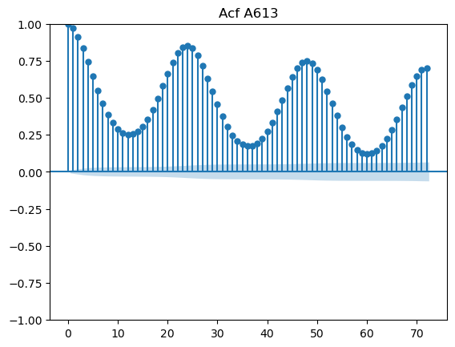
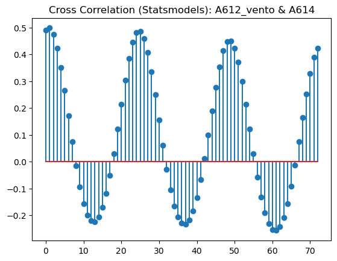

# Relatorio do Trabalho 2

#### Professor: Ivan Robert Enriquez Guzman

#### Alunos:
- Hugo Batista da Silva
- João Paulo de Paiva Holz

## Introdução

Eventos raros ou extremos têm grande relevância na climatologia e hidrologia, e suas estimativas probabilísticas são imprescindíveis para o planejamento e desenvolvimento das atividades sujeitas a seus efeitos adversos, especialmente estruturas de engenharia civil e agricultura. Por isso é de extrema importância analisar variáveis para estudar tendências, e podemos fazer isso com métodos regressivos usando séries temporais.

### Sobre o dataset

#### Fonte: [Dados de tempo Inmet - Kaggle](https://www.kaggle.com/datasets/PROPPG-PPG/hourly-weather-surface-brazil-southeast-region)


### Dados que utilizaremos

Escolhemos 4 estações meteorologicas para trabalhar com os dados. 

<br>


Codigo|Cidade
---|---
A612|Vitoria - Ufes
A634|Vila Velha
A614|Linhares
A613|Santa Teresa

<br>
    
    
Mantivemos temperatura maxima na hora anterior, precipitação total, pressao atmosferica ao nivel da estacao e rajada de vento maxima na hora, total de 4 covariaveis de 4 estações meteorologicas diferentes, 16 variaveis aleatorias, onde utilizaremos 4 como reposta e 12 como variaveis preditoras


## Importando Bibliotecas


```python
import pandas as pd, numpy as np
import matplotlib.pyplot as plt
#from jh_utils.data.pandas.preprocessing import make_dummies
from get_df import get_data_for_ml,keep_cols,small_column_names_for_mldf
from plot import lines_plot, columnX, plot_ccf_sm, cross_plots
import seaborn as sns
import statsmodels.tsa.stattools as smt
from get_df import get_data_for_ml,keep_cols, get_data, get_dfs_for_ml
from itertools import combinations,permutations
```

## Importando Dados


```python
df,df_just_stocastic = get_dfs_for_ml('temperatura maxima na hora ant.')
df_just_stocastic.columns = df_just_stocastic.columns

_,precipitacao = get_dfs_for_ml()
precipitacao.columns = precipitacao.columns + '_volume_chuva'
precipitacao = precipitacao.iloc[:,1:]

_,stp = get_dfs_for_ml('pressao atmosferica ao nivel da estacao')
stp.columns = stp.columns + '_pressao'
stp = stp.iloc[:,1:]

_,gust = get_dfs_for_ml('vento rajada maxima')
gust.columns = gust.columns + '_vento'
gust = gust.iloc[:,1:]
```

    /home/joaoholz/Documents/LSTAT/joao/trabalho2/get_df.py:29: FutureWarning: Series.dt.weekofyear and Series.dt.week have been deprecated. Please use Series.dt.isocalendar().week instead.
      df['weekofyear'] = df.date_time.dt.weekofyear
    /home/joaoholz/Documents/LSTAT/joao/trabalho2/get_df.py:29: FutureWarning: Series.dt.weekofyear and Series.dt.week have been deprecated. Please use Series.dt.isocalendar().week instead.
      df['weekofyear'] = df.date_time.dt.weekofyear
    /home/joaoholz/Documents/LSTAT/joao/trabalho2/get_df.py:29: FutureWarning: Series.dt.weekofyear and Series.dt.week have been deprecated. Please use Series.dt.isocalendar().week instead.
      df['weekofyear'] = df.date_time.dt.weekofyear
    /home/joaoholz/Documents/LSTAT/joao/trabalho2/get_df.py:29: FutureWarning: Series.dt.weekofyear and Series.dt.week have been deprecated. Please use Series.dt.isocalendar().week instead.
      df['weekofyear'] = df.date_time.dt.weekofyear


```python
variables = pd.concat([df_just_stocastic.iloc[:,1:],precipitacao,stp,gust],axis=1)
```

## Analise Exploratoria de Dados

vemos que aa variavel que possui maior correlação entre as estações é o vento e a temperatura máxima entre as estações.
fora selecionado justamente essas variáveis para realizar os modelos e testes para não haver homecedasticidade. Percebemos também que
a variável pressão é a que possui menos correlação entre as estações (futuramente ela será excluída das análises por não apresentar diferença
nos gráficos dos testes)


```python
_ = sns.heatmap(variables.corr())
_ = plt.title('Mapa de calor de correlação')
```


    

    


Observando o gráfico da temperatura máxima das estações vemos que apenas as barras de Santa Teresa que possui uma média muito distante das demais.
Isso se deve ao fato de que o clima em Santa Teresa ser mais frio na maioria dos dias do ano em comparação aos outros municípios do ES. Vemos que
a temperatura de 25° C é a que mais possui volume de dados para o restante das estações.


```python
_ = sns.histplot(df_just_stocastic)
_ = plt.title('Histograma de temperaturas')
```


    

    


comparando os dois gráficos da evolução da temperatura máxima durante os meses vemos que santa teresa sempre se manteve abaixodas demais estações
e houve alguns picos de temperatura para vila velha no final do ano de 2017.


```python
_ = lines_plot(df_just_stocastic,['A612','A613','A614','A634'],freq='D')
_ = plt.title('Evolução da temperatura diaria na estações')
```


    

    


```python
_ = lines_plot(df_just_stocastic,['A612','A613','A614','A634'],freq='w')
_ = plt.title('Evolução da temperatura semanal na estações')
```


    

    


Vemos que as temperaturas máximas cruzadas pelas estações seguemuma distribuição que se assemelha à normal e na nuvem de pontos há um comportamento linear.


```python
_ = sns.pairplot(df_just_stocastic)
_ = plt.title('Gráfico de distribuição de pontos - Scatterplot')
```


    

    


## Modelo

## Autocorrelação e Autocorrelação parcial 

Uma análise de série temporal simples é sempre uma análise sobre o que já aconteceu na própria série e com a correlação não seria diferente. Uma correlação nos diz o quão relacionado é um valor com outro valor (isso não significa que um valor influenciou o outro) e uma autocorrelação (ACF) é quando comparamos o valor do presente com valores do passado da mesma série. A diferença entre a autocorrelação e a autocorrelação parcial (PACF) é quase um detalhe: em uma ACF temos a correlação direta e indireta e em uma PACF apenas a correlação direta. Exemplificando, com a ACF vemos a correlação direta do mês de janeiro em março e também a correlação indireta que o mês de janeiro teve em fevereiro que também teve em março.  

## Modelos para Séries Temporais
### Autorregressão (AR)}
Uma autoregressão é basicamente uma regressão onde seus parâmetros são regressões em tempos anteriores.

$$ X(t) = a + b_1x(t - 1) + b_2x(t - 2) + ... + b_nx(t - n)$$

Onde $a$, $b_1$, $b_2$, ... , $b_n$ são os coeficientes da regressão e $t$ é o indicador de qual tempo estamos usando na regressão $X$.

### Moving Average Model (MA)}
Apesar do nome o Moving Average Model não é a mesma coisa que apenas calcular a média móvel da série temporal. O MA é um modelo linear, assim como a regressão, que usa os resíduos dos passos anteriores como variáveis. Esses resíduos são calculados a partir da diferença com a média dessa série, tendo uma série que se move em volta da sua média.

$$ X_t = \mu + \epsilon_t + \theta_1\epsilon_{t-1} + ... + \theta_q\epsilon_{t-q}$$

Onde $\mu$ é a média da série, $\epsilon$ são os resíduos de acordo com o tempo $t$ até $t - q$ e $\theta$ são os coeficientes de cada variável.

O modelo MA pode ser usado como parte do modelo ARMA (AR + MA) deixando a ordem da AR em zero.

## Notas para o nosso modelo
Para montarmos o nosso modelo vamos utilizar acfs e pacfs e cross correlation para viabilizar o uso de um modelo VAR

Definiremos nosso Y como sendo a tempratura maxima das estações.   
As Covariaveis utilizaremos as que deram relevante na apresentação passada utilizando CrossCorrelation.   

### ACFS

ACFs abaixo vemos esse comportamento de senoide com periodo de 24. Como temos uma serie horário já era esperado. Vamos utilizar esse periodo como lag no modelox


```python
from statsmodels.graphics.tsaplots import plot_acf, plot_pacf
```


```python
_ = plot_acf(df_just_stocastic.iloc[:,1],lags=72)
_ = plt.title('Acf '+ df_just_stocastic.columns[1])
_ = plot_acf(df_just_stocastic.iloc[:,2],lags=72)
_ = plt.title('Acf '+ df_just_stocastic.columns[2])
_ = plot_acf(df_just_stocastic.iloc[:,3],lags=72)
_ = plt.title('Acf '+ df_just_stocastic.columns[3])
_ = plot_acf(df_just_stocastic.iloc[:,4],lags=72)
_ = plt.title('Acf '+ df_just_stocastic.columns[4])
```


    

    


    

    


    

    


    

    


### PACFS


```python
_ = plot_pacf(df_just_stocastic.iloc[:,1],lags=72)
_ = plt.title('Acf '+ df_just_stocastic.columns[1])
_ = plot_pacf(df_just_stocastic.iloc[:,2],lags=72)
_ = plt.title('Acf '+ df_just_stocastic.columns[2])
_ = plot_pacf(df_just_stocastic.iloc[:,3],lags=72)
_ = plt.title('Acf '+ df_just_stocastic.columns[3])
_ = plot_pacf(df_just_stocastic.iloc[:,4],lags=72)
_ = plt.title('Acf '+ df_just_stocastic.columns[4])
```

    /home/joaoholz/miniconda3/envs/lestat/lib/python3.10/site-packages/statsmodels/graphics/tsaplots.py:348: FutureWarning: The default method 'yw' can produce PACF values outside of the [-1,1] interval. After 0.13, the default will change tounadjusted Yule-Walker ('ywm'). You can use this method now by setting method='ywm'.
      warnings.warn(


    

    


    

    


    

    


    

    


Após analisar os gráficos ACF e PACF, a percebemos uma correlação negativa entre as variáveis volume da chuva com temperatura máxima.
e uma correlação posivita com a pressão, porém é muito baixa.## Modelo

### Cross Correlation


```python
cross_plots(variables[['A614', 'A634','A612', 'A612_volume_chuva','A612_vento']])
```


    

    


    

    


    

    


    

    


    

    


    

    


    

    


    

    


    

    


    

    


    

    


    

    


    

    


    

    


    

    


    

    


    

    


    

    


    

    


    

    


```python
from statsmodels.tsa.api import VAR
```


```python
variables.index = df_just_stocastic.date_time
variables2 = variables.resample('D').mean()
```


```python
model = VAR(variables2.iloc[:,:4],variables2.iloc[:,4:])
fit = model.fit(maxlags=4)
fit.summary()
```


      Summary of Regression Results   
    ==================================
    Model:                         VAR
    Method:                        OLS
    Date:           Mon, 06, Feb, 2023
    Time:                     20:10:18
    --------------------------------------------------------------------
    No. of Equations:         4.00000    BIC:                   -1.97681
    Nobs:                     1531.00    HQIC:                  -2.23054
    Log likelihood:          -6750.98    FPE:                  0.0924661
    AIC:                     -2.38093    Det(Omega_mle):       0.0857798
    --------------------------------------------------------------------
    Results for equation A613
    ====================================================================================
                           coefficient       std. error           t-stat            prob
    ------------------------------------------------------------------------------------
    const                   117.621637        11.213055           10.490           0.000
    A613_volume_chuva        -0.080485         0.043714           -1.841           0.066
    A614_volume_chuva        -0.418809         0.098674           -4.244           0.000
    A634_volume_chuva        -0.148261         0.079530           -1.864           0.062
    A612_volume_chuva         0.030178         0.076605            0.394           0.694
    A613_pressao              0.197597         0.033608            5.879           0.000
    A614_pressao              0.045425         0.034150            1.330           0.183
    A634_pressao             -0.205401         0.044080           -4.660           0.000
    A612_pressao             -0.126753         0.047798           -2.652           0.008
    A613_vento                0.094700         0.019864            4.767           0.000
    A614_vento               -0.267232         0.027101           -9.861           0.000
    A634_vento                0.040666         0.021471            1.894           0.058
    A612_vento                0.005467         0.034076            0.160           0.873
    L1.A613                   0.793244         0.031657           25.057           0.000
    L1.A614                  -0.018843         0.044021           -0.428           0.669
    L1.A634                   0.155351         0.046502            3.341           0.001
    L1.A612                  -0.073949         0.041627           -1.776           0.076
    L2.A613                  -0.157149         0.038393           -4.093           0.000
    L2.A614                   0.079297         0.048679            1.629           0.103
    L2.A634                  -0.143305         0.054191           -2.644           0.008
    L2.A612                  -0.087146         0.047233           -1.845           0.065
    L3.A613                   0.093677         0.038328            2.444           0.015
    L3.A614                  -0.020748         0.048044           -0.432           0.666
    L3.A634                  -0.043505         0.054535           -0.798           0.425
    L3.A612                   0.061201         0.047212            1.296           0.195
    L4.A613                   0.088364         0.031258            2.827           0.005
    L4.A614                   0.068145         0.041360            1.648           0.099
    L4.A634                  -0.017024         0.045973           -0.370           0.711
    L4.A612                  -0.033374         0.040594           -0.822           0.411
    ====================================================================================
    
    Results for equation A614
    ====================================================================================
                           coefficient       std. error           t-stat            prob
    ------------------------------------------------------------------------------------
    const                    76.850016         8.685849            8.848           0.000
    A613_volume_chuva        -0.021550         0.033862           -0.636           0.525
    A614_volume_chuva        -0.758914         0.076434           -9.929           0.000
    A634_volume_chuva        -0.174349         0.061606           -2.830           0.005
    A612_volume_chuva         0.047854         0.059340            0.806           0.420
    A613_pressao              0.279537         0.026034           10.737           0.000
    A614_pressao             -0.100719         0.026453           -3.807           0.000
    A634_pressao             -0.148174         0.034146           -4.339           0.000
    A612_pressao             -0.071532         0.037025           -1.932           0.053
    A613_vento                0.017789         0.015387            1.156           0.248
    A614_vento               -0.028451         0.020993           -1.355           0.175
    A634_vento               -0.009976         0.016632           -0.600           0.549
    A612_vento                0.025428         0.026396            0.963           0.335
    L1.A613                   0.201857         0.024522            8.232           0.000
    L1.A614                   0.495258         0.034099           14.524           0.000
    L1.A634                   0.181305         0.036021            5.033           0.000
    L1.A612                  -0.064019         0.032245           -1.985           0.047
    L2.A613                  -0.151998         0.029740           -5.111           0.000
    L2.A614                   0.130814         0.037708            3.469           0.001
    L2.A634                  -0.178330         0.041978           -4.248           0.000
    L2.A612                  -0.047482         0.036588           -1.298           0.194
    L3.A613                   0.016593         0.029689            0.559           0.576
    L3.A614                   0.093366         0.037216            2.509           0.012
    L3.A634                   0.004135         0.042244            0.098           0.922
    L3.A612                   0.015418         0.036571            0.422           0.673
    L4.A613                  -0.057808         0.024213           -2.387           0.017
    L4.A614                   0.126281         0.032038            3.942           0.000
    L4.A634                  -0.012477         0.035612           -0.350           0.726
    L4.A612                   0.018569         0.031445            0.591           0.555
    ====================================================================================
    
    Results for equation A634
    ====================================================================================
                           coefficient       std. error           t-stat            prob
    ------------------------------------------------------------------------------------
    const                    44.869466         9.336003            4.806           0.000
    A613_volume_chuva        -0.045730         0.036397           -1.256           0.209
    A614_volume_chuva        -0.261497         0.082156           -3.183           0.001
    A634_volume_chuva        -0.358922         0.066217           -5.420           0.000
    A612_volume_chuva        -0.083815         0.063781           -1.314           0.189
    A613_pressao              0.338236         0.027982           12.087           0.000
    A614_pressao              0.060972         0.028433            2.144           0.032
    A634_pressao             -0.247833         0.036701           -6.753           0.000
    A612_pressao             -0.153968         0.039797           -3.869           0.000
    A613_vento                0.061414         0.016539            3.713           0.000
    A614_vento               -0.164062         0.022564           -7.271           0.000
    A634_vento                0.077128         0.017877            4.314           0.000
    A612_vento                0.061095         0.028371            2.153           0.031
    L1.A613                   0.163804         0.026358            6.215           0.000
    L1.A614                   0.002895         0.036652            0.079           0.937
    L1.A634                   0.664519         0.038717           17.163           0.000
    L1.A612                  -0.131073         0.034659           -3.782           0.000
    L2.A613                  -0.113371         0.031966           -3.547           0.000
    L2.A614                   0.057802         0.040530            1.426           0.154
    L2.A634                  -0.087762         0.045120           -1.945           0.052
    L2.A612                  -0.000306         0.039326           -0.008           0.994
    L3.A613                   0.022754         0.031912            0.713           0.476
    L3.A614                  -0.024240         0.040001           -0.606           0.545
    L3.A634                   0.016017         0.045406            0.353           0.724
    L3.A612                   0.038276         0.039308            0.974           0.330
    L4.A613                  -0.053837         0.026025           -2.069           0.039
    L4.A614                   0.075406         0.034436            2.190           0.029
    L4.A634                   0.194377         0.038277            5.078           0.000
    L4.A612                  -0.072353         0.033798           -2.141           0.032
    ====================================================================================
    
    Results for equation A612
    ====================================================================================
                           coefficient       std. error           t-stat            prob
    ------------------------------------------------------------------------------------
    const                    61.386895         9.910159            6.194           0.000
    A613_volume_chuva        -0.047599         0.038635           -1.232           0.218
    A614_volume_chuva        -0.262227         0.087208           -3.007           0.003
    A634_volume_chuva        -0.244337         0.070289           -3.476           0.001
    A612_volume_chuva        -0.287820         0.067704           -4.251           0.000
    A613_pressao              0.373272         0.029703           12.567           0.000
    A614_pressao              0.047929         0.030182            1.588           0.112
    A634_pressao             -0.128901         0.038959           -3.309           0.001
    A612_pressao             -0.305968         0.042244           -7.243           0.000
    A613_vento                0.055682         0.017556            3.172           0.002
    A614_vento               -0.213504         0.023952           -8.914           0.000
    A634_vento               -0.002019         0.018976           -0.106           0.915
    A612_vento                0.277966         0.030116            9.230           0.000
    L1.A613                   0.156365         0.027979            5.589           0.000
    L1.A614                   0.025122         0.038906            0.646           0.518
    L1.A634                   0.091933         0.041098            2.237           0.025
    L1.A612                   0.396148         0.036790           10.768           0.000
    L2.A613                  -0.110984         0.033932           -3.271           0.001
    L2.A614                   0.027552         0.043023            0.640           0.522
    L2.A634                  -0.102311         0.047894           -2.136           0.033
    L2.A612                   0.014000         0.041745            0.335           0.737
    L3.A613                   0.039935         0.033874            1.179           0.238
    L3.A614                  -0.013530         0.042461           -0.319           0.750
    L3.A634                  -0.039808         0.048198           -0.826           0.409
    L3.A612                   0.121918         0.041726            2.922           0.003
    L4.A613                  -0.048781         0.027626           -1.766           0.077
    L4.A614                   0.086595         0.036554            2.369           0.018
    L4.A634                  -0.043046         0.040631           -1.059           0.289
    L4.A612                   0.109190         0.035877            3.043           0.002
    ====================================================================================
    
    Correlation matrix of residuals
                A613      A614      A634      A612
    A613    1.000000  0.592002  0.507896  0.495729
    A614    0.592002  1.000000  0.561493  0.564456
    A634    0.507896  0.561493  1.000000  0.741676
    A612    0.495729  0.564456  0.741676  1.000000
    


## Conclusão

Mantivemos velocidade do vento, pressão atmosferica, precipitação no modelo, vemos que todos são bem relevantes para as proprias cidades e alguns são apareceram relevantes para cidades proximas. Mais proximo mais esperado das coisas darem relevantes.  
Vemos que as temperaturas se explicam bem, quando adicionamos as outras covariaveis elas todas se tornam significativas em pelo menos 1 dos 4 modelos, principalemnte os das mesmas cidades.  
Talvez resumir a serie por dia ou utilizar a sazonalidade melhor, evoluir o modelo para um SARIMA para proximos estudos. Não adicionamos formas de absorver a sazonalidade que encontramos mesmo que o modelo tenha se saido bem.
